# WebCraft - Universal No-Code Platform Architecture

## System Architecture Diagram

```mermaid
graph TB
    subgraph "Frontend Layer - Universal Builder"
        A[Next.js App] --> B[Live Visual Editor]
        A --> C[Template Marketplace]
        A --> D[Widget/Plugin Store]
        A --> E[App Dashboard]
        B --> F[Drag & Drop Canvas]
        B --> G[Real-time Preview]
        B --> H[AI Design Assistant]
        F --> I[Component Library]
        G --> J[Multi-Device Preview]
        A --> STATIC[Static Site Generator UI]
        A --> AUTO[Automation Builder UI]
    end
    
    subgraph "API Layer - Mobile/Web Friendly"
        K[FastAPI Gateway] --> L[REST API v1/v2]
        K --> M[GraphQL Endpoint]
        K --> N[WebSocket API]
        K --> O[SDK Generator]
        L --> P[OpenAPI/Swagger Docs]
        M --> Q[GraphQL Playground]
        O --> R[Mobile SDKs - iOS/Android]
        O --> S[Web SDKs - JS/React/Vue]
    end
    
    subgraph "Core Builder Services"
        T[Auth & User Management]
        U[App Builder Engine]
        V[Template System]
        W[Widget/Plugin Manager]
        X[AI Integration Hub]
        Y[Deployment Engine]
        Z[Integration Manager]
        AA[API Management]
    end
    
    subgraph "Automation Engine"
        AUTO1[Visual Workflow Builder]
        AUTO2[Trigger Manager]
        AUTO3[Action Executor]
        AUTO4[Condition Evaluator]
        AUTO5[Schedule Manager]
        AUTO6[Webhook Handler]
        AUTO7[Event Bus]
        AUTO8[Automation Templates]
        AUTO9[Variable Store]
        AUTO10[Error Handler & Retry]
    end
    
    subgraph "Static Site Export Engine"
        SSG1[HTML Generator]
        SSG2[CSS Bundler & Optimizer]
        SSG3[JS Minifier]
        SSG4[Asset Optimizer]
        SSG5[Image Compression]
        SSG6[Font Subsetter]
        SSG7[SEO Pre-renderer]
        SSG8[Sitemap Generator]
        SSG9[ZIP Packager]
        SSG10[CDN Deploy Option]
        SSG11[GitHub Pages Export]
        SSG12[Netlify/Vercel Deploy]
    end
    
    subgraph "Business Logic Services"
        BB[ERP Module Service]
        CC[CRM Module Service]
        DD[E-commerce Engine]
        EE[Inventory Management]
        FF[Automation Engine]
        GG[Analytics Service]
        HH[Workflow Builder]
        II[Content Management]
        JJ[User Data API]
    end
    
    subgraph "Integration Layer"
        KK[Payment Gateway Hub]
        LL[Google Workspace API]
        MM[Third-party API Manager]
        NN[Email/SMS Service]
        OO[Cloud Storage Hub]
        PP[Marketing Tools API]
        QQ[Mobile Push Notifications]
    end
    
    subgraph "SEO & Marketing Engine"
        HHH[SEO Optimization Service]
        III[AI-Friendly Markup Generator]
        JJJ[Structured Data Manager]
        KKK[Meta Tag Optimizer]
        LLL[Sitemap Generator]
        MMM[Schema.org Builder]
        NNN[Open Graph Manager]
        OOO[Twitter Cards Generator]
        PPP[JSON-LD Injector]
        QQQ[Robots.txt Manager]
        RRR[Core Web Vitals Monitor]
        SSS[AI Bot Detection & Optimization]
    end
    
    subgraph "Content & Marketing APIs"
        TTT[Content API for AI Crawlers]
        UUU[Marketing Automation]
        VVV[A/B Testing Engine]
        WWW[Analytics & Tracking]
        XXX[Social Media Integration]
        YYY[Email Marketing API]
        ZZZ[Lead Generation Tools]
        AAAA[Conversion Tracking]
    end
    
    subgraph "Data Sources & Scraping"
        DS1[External API Connector]
        DS2[Authentication Manager]
        DS3[Rate Limiter]
        DS4[Response Cache]
        DS5[Field Mapper]
        WS1[Web Scraper Engine]
        WS2[HTML Parser]
        WS3[Selector Engine]
        WS4[Pagination Handler]
        WS5[Robots.txt Checker]
        WS6[Schedule Manager]
        WDB[Widget Data Binder]
    end
    
    subgraph "Data & Infrastructure"
        RR[(PostgreSQL - Multi-tenant)]
        SS[(Redis - Cache & Sessions)]
        TT[Kafka - Event Streaming]
        UU[File Storage - S3/MinIO]
        VV[Search Engine - Elasticsearch]
        WWWW[CDN with Edge SEO]
        XXXX[AI Crawler Cache Layer]
    end
    
    subgraph "Deployment & Hosting"
        WW[Container Registry]
        XX[Kubernetes Cluster]
        YY[Domain Management]
        ZZ[CDN & Edge Caching]
        AAA[SSL/Security Layer]
        BBBB[SEO-Optimized Rendering]
    end
    
    subgraph "External Integrations"
        BBB[AI Services - OpenAI/Gemini]
        CCC[Payment Processors]
        DDD[Domain Registrars]
        EEE[Cloud Providers]
        FFF[Google/Microsoft APIs]
        GGG[Marketing Platforms]
    end
    
    A -.->|WebSocket| K
    K --> T & U & V & W & X & Y & Z & AA
    U --> BB & CC & DD & EE & FF & GG & HH & II & JJ
    Z --> KK & LL & MM & NN & OO & PP & QQ
    K --> RR & SS & TT & UU & VV & WWWW & XXXX
    Y --> WW & XX & YY & ZZ & AAA & BBBB
    X --> BBB
    KK --> CCC
    YY --> DDD
    Y --> EEE
    LL --> FFF
    PP --> GGG
    HHH --> III & JJJ & KKK & LLL & MMM & NNN & OOO & PPP & QQQ & RRR & SSS
    TTT --> UUU & VVV & WWW & XXX & YYY & ZZZ & AAAA
    U --> HHH & TTT
    
    %% Automation connections
    AUTO --> AUTO1 & AUTO2 & AUTO3 & AUTO4 & AUTO5 & AUTO6 & AUTO7 & AUTO8 & AUTO9 & AUTO10
    U --> AUTO1
    AUTO2 --> AUTO7
    AUTO7 --> TT
    AUTO3 --> Z
    AUTO6 --> K
    
    %% Static Site Export connections
    STATIC --> SSG1
    SSG1 --> SSG2 & SSG3 & SSG4 & SSG7
    SSG4 --> SSG5 & SSG6
    SSG7 --> SSG8
    SSG1 --> SSG9
    SSG9 --> SSG10 & SSG11 & SSG12
    U --> SSG1
```



## Platform Capabilities

### 1. Universal App Types
- **Business Applications**: ERP, CRM, Project Management, HR Systems
- **E-commerce Solutions**: Online stores, Inventory management, Warehouse systems
- **Content Platforms**: Blogs, News sites, Documentation, Portfolios
- **Service Platforms**: Booking systems, Delivery apps, Service marketplaces
- **Community Platforms**: Forums, Social networks, Event management
- **Automation Tools**: Workflow builders, Data processors, Integration hubs
- **Static Sites**: Landing pages, Portfolios, Documentation sites (exportable)

### 2. Core Builder Features
- **Visual Editor**: Drag-and-drop interface with real-time preview
- **Template System**: Pre-built templates for all app types
- **Widget Marketplace**: Reusable components and plugins
- **AI Assistant**: Content generation, design suggestions, code generation
- **Multi-tenant Architecture**: Isolated data and customization per user
- **Real-time Collaboration**: Team editing with live cursors and changes

### 3. Integration Ecosystem
- **Payment Systems**: Stripe, PayPal, Square, regional processors
- **Google Workspace**: Drive, Gmail, Calendar, Sheets integration
- **Microsoft 365**: OneDrive, Outlook, Teams integration
- **Marketing Tools**: Mailchimp, HubSpot, Google Analytics
- **Cloud Storage**: AWS S3, Google Cloud, Dropbox, OneDrive
- **Communication**: Twilio, SendGrid, Slack, Discord
- **AI Services**: OpenAI, Google Gemini, Anthropic Claude

### 3.1 External Data Sources
Connect to any third-party API as a data source for widgets:

#### Authentication Types
- **No Auth**: Public APIs without authentication
- **API Key**: Header or query parameter based API keys
- **Bearer Token**: OAuth2 bearer token authentication
- **Basic Auth**: Username/password authentication
- **Custom Headers**: Custom header-based authentication

#### Features
- **Rate Limiting**: Configurable rate limits per data source
- **Response Caching**: TTL-based caching to reduce API calls
- **Field Mapping**: Map API response fields to widget-friendly format
- **Retry Logic**: Automatic retry with exponential backoff
- **Pagination Support**: Handle paginated API responses

#### Example Data Sources
```
1. Weather API:
   Base URL: https://api.weather.com/v1
   Auth: API Key (X-API-Key header)
   Endpoints: /current, /forecast, /alerts

2. Stock Market API:
   Base URL: https://api.stocks.com/v2
   Auth: Bearer Token
   Endpoints: /quotes, /history, /news

3. CMS API:
   Base URL: https://cms.example.com/api
   Auth: Basic Auth
   Endpoints: /posts, /pages, /media
```

### 3.2 Web Scraper System
Scrape and extract data from any website to display in widgets:

#### Selector Types
- **CSS Selectors**: Standard CSS selectors for element selection
- **XPath**: XPath expressions for complex selections
- **Regex**: Regular expressions for text extraction

#### Features
- **Robots.txt Compliance**: Respects robots.txt by default
- **Rate Limiting**: Configurable delay between requests
- **Pagination**: Automatic pagination handling
- **Scheduling**: Cron-based scheduled scraping
- **Caching**: TTL-based result caching
- **Preview Mode**: Test scraper before saving

#### Field Extractors
```json
{
  "name": "product_title",
  "selector": "h1.product-name",
  "selector_type": "css",
  "attribute": null,
  "transform": "trim"
}
```

#### Transform Options
- **trim**: Remove whitespace
- **lowercase/uppercase**: Case transformation
- **number**: Extract numeric value
- **date**: Parse date string

#### Example Scrapers
```
1. Product Scraper:
   URL: https://shop.example.com/products
   Fields: title, price, image, description
   Pagination: Next button selector

2. News Scraper:
   URL: https://news.example.com
   Fields: headline, summary, date, author
   Schedule: Every 30 minutes

3. Job Listings:
   URL: https://jobs.example.com/search
   Fields: title, company, location, salary
   Max Pages: 5
```

### 4. SEO & AI-Friendly Features
- **AI Crawler Optimization**: Specialized markup for GPT, Claude, Gemini crawlers
- **Structured Data**: Auto-generated Schema.org, JSON-LD, microdata
- **Meta Optimization**: Dynamic meta tags, Open Graph, Twitter Cards
- **Core Web Vitals**: Real-time performance monitoring and optimization
- **AI-Readable Content**: Clean HTML structure for AI comprehension
- **Semantic Markup**: Rich snippets, breadcrumbs, FAQ schemas
- **Multi-language SEO**: Hreflang tags, localized content optimization
- **Voice Search Ready**: Conversational content structure
- **Featured Snippets**: Optimized content for Google's featured snippets
- **Local SEO**: Google My Business integration, local schema markup

### 5. Marketing & Analytics Integration
- **Google Analytics 4**: Enhanced e-commerce tracking, custom events
- **Google Search Console**: Automated sitemap submission, indexing API
- **Facebook Pixel**: Conversion tracking, custom audiences
- **Google Ads**: Conversion tracking, remarketing tags
- **Email Marketing**: Mailchimp, ConvertKit, SendGrid integration
- **Social Media**: Auto-posting, social proof widgets
- **A/B Testing**: Built-in split testing for pages and components
- **Heat Maps**: User behavior tracking and analysis
- **Lead Generation**: Forms, pop-ups, exit-intent captures
- **Marketing Automation**: Drip campaigns, behavioral triggers

### 6. Deployment & Hosting
- **Custom Domains**: Full domain management and SSL
- **Subdomain System**: app-name.webcraft.com
- **Auto-scaling**: Kubernetes-based infrastructure
- **Global CDN**: Edge caching for performance
- **Database Per App**: Isolated PostgreSQL instances
- **Backup & Recovery**: Automated data protection

### 7. Automation System (Client-Facing)
Clients can add powerful automation to their projects with a visual workflow builder:

#### Trigger Types
- **Time-based Triggers**: Cron schedules, intervals, specific dates/times
- **Event Triggers**: Form submissions, user signups, purchases, page views
- **Webhook Triggers**: External API calls, third-party integrations
- **Data Triggers**: Database changes, threshold alerts, inventory levels
- **User Action Triggers**: Button clicks, cart abandonment, inactivity

#### Action Types
- **Communication Actions**: Send emails, SMS, push notifications, Slack messages
- **Data Actions**: Create/update/delete records, sync to external systems
- **Integration Actions**: Call external APIs, trigger webhooks, update CRM
- **Content Actions**: Publish content, update pages, generate reports
- **E-commerce Actions**: Update inventory, process orders, apply discounts
- **User Actions**: Assign roles, send invites, update profiles

#### Workflow Features
- **Visual Flow Builder**: Drag-and-drop workflow designer
- **Conditional Logic**: If/else branches, switch cases, filters
- **Loops & Iterations**: Process lists, batch operations
- **Delays & Scheduling**: Wait steps, scheduled execution
- **Error Handling**: Retry logic, fallback actions, notifications
- **Variables & Data Mapping**: Dynamic data between steps
- **Templates**: Pre-built automation recipes
- **Version Control**: Workflow history and rollback
- **Testing Mode**: Dry-run automations before activation
- **Logs & Monitoring**: Execution history, performance metrics

#### Example Automations
```
1. E-commerce Order Flow:
   Trigger: New Order → Actions: Send confirmation email → Update inventory → 
   Notify warehouse → Create shipping label → Send tracking to customer

2. Lead Nurturing:
   Trigger: Form submission → Actions: Add to CRM → Send welcome email → 
   Wait 3 days → Send follow-up → Check engagement → Branch based on response

3. Content Publishing:
   Trigger: Scheduled time → Actions: Publish blog post → Share to social media → 
   Send newsletter → Update sitemap → Ping search engines

4. Inventory Alert:
   Trigger: Stock < threshold → Actions: Send alert to admin → 
   Create purchase order → Notify supplier → Update product status
```

### 8. Static Site Export System
Users who generate static sites can export their complete site for self-hosting:

#### Export Formats
- **ZIP Download**: Complete site package with all assets
- **GitHub Repository**: Direct push to GitHub with optional GitHub Pages setup
- **Netlify Deploy**: One-click deploy to Netlify
- **Vercel Deploy**: One-click deploy to Vercel
- **AWS S3 Export**: Direct upload to S3 bucket with CloudFront setup
- **FTP/SFTP Upload**: Direct upload to any hosting provider

#### Export Contents
```
exported-site/
├── index.html              # Main entry point
├── pages/                  # All generated HTML pages
│   ├── about.html
│   ├── contact.html
│   └── blog/
│       ├── index.html
│       └── [posts].html
├── assets/
│   ├── css/
│   │   ├── styles.min.css  # Bundled & minified CSS
│   │   └── critical.css    # Above-the-fold CSS
│   ├── js/
│   │   ├── main.min.js     # Bundled & minified JS
│   │   └── vendors.min.js  # Third-party libraries
│   ├── images/             # Optimized images (WebP + fallbacks)
│   ├── fonts/              # Subsetted web fonts
│   └── icons/              # Favicons & app icons
├── seo/
│   ├── sitemap.xml         # Auto-generated sitemap
│   ├── robots.txt          # Configured robots file
│   └── structured-data/    # JSON-LD files
├── _redirects              # Netlify redirects (if applicable)
├── vercel.json             # Vercel config (if applicable)
├── .htaccess               # Apache config (optional)
└── README.md               # Deployment instructions
```

#### Optimization Features
- **HTML Minification**: Remove whitespace, comments, optimize structure
- **CSS Processing**: Purge unused CSS, minify, critical CSS extraction
- **JavaScript Bundling**: Tree-shaking, code splitting, minification
- **Image Optimization**: WebP conversion, responsive images, lazy loading placeholders
- **Font Optimization**: Subsetting, preloading, font-display optimization
- **SEO Pre-rendering**: All meta tags, structured data, Open Graph baked in
- **Performance Score**: Lighthouse audit before export with suggestions

#### Export Options
- **Include Analytics**: Option to include/exclude tracking scripts
- **Custom Domain Config**: Generate configs for custom domain setup
- **Form Handling**: Option to use Formspree, Netlify Forms, or custom endpoint
- **Asset CDN**: Option to use external CDN for assets
- **Compression**: Gzip/Brotli pre-compressed files
- **Source Maps**: Optional source maps for debugging

#### Post-Export Features
- **Deployment Guide**: Step-by-step instructions for each hosting platform
- **DNS Configuration**: Instructions for domain setup
- **SSL Setup Guide**: Free SSL certificate setup instructions
- **Update Workflow**: Re-export and deploy updates easily

---

## Technical Implementation Details

### Automation Engine Architecture
```
┌─────────────────────────────────────────────────────────────┐
│                    Automation Engine                         │
├─────────────────────────────────────────────────────────────┤
│  ┌─────────────┐  ┌─────────────┐  ┌─────────────────────┐  │
│  │   Trigger   │  │  Workflow   │  │   Action            │  │
│  │   Manager   │──│  Executor   │──│   Dispatcher        │  │
│  └─────────────┘  └─────────────┘  └─────────────────────┘  │
│         │               │                    │               │
│         ▼               ▼                    ▼               │
│  ┌─────────────┐  ┌─────────────┐  ┌─────────────────────┐  │
│  │   Event     │  │  Condition  │  │   Integration       │  │
│  │   Queue     │  │  Evaluator  │  │   Connectors        │  │
│  │  (Kafka)    │  └─────────────┘  └─────────────────────┘  │
│  └─────────────┘                                             │
│         │                                                    │
│         ▼                                                    │
│  ┌─────────────────────────────────────────────────────────┐│
│  │              Execution Log & Monitoring                  ││
│  │         (PostgreSQL + Redis + Elasticsearch)             ││
│  └─────────────────────────────────────────────────────────┘│
└─────────────────────────────────────────────────────────────┘
```

### Static Site Generator Architecture
```
┌─────────────────────────────────────────────────────────────┐
│                 Static Site Generator                        │
├─────────────────────────────────────────────────────────────┤
│  ┌─────────────┐  ┌─────────────┐  ┌─────────────────────┐  │
│  │   Page      │  │   Asset     │  │   SEO               │  │
│  │   Renderer  │──│   Pipeline  │──│   Optimizer         │  │
│  └─────────────┘  └─────────────┘  └─────────────────────┘  │
│         │               │                    │               │
│         ▼               ▼                    ▼               │
│  ┌─────────────┐  ┌─────────────┐  ┌─────────────────────┐  │
│  │   HTML      │  │   Image     │  │   Structured        │  │
│  │   Minifier  │  │   Optimizer │  │   Data Gen          │  │
│  └─────────────┘  └─────────────┘  └─────────────────────┘  │
│         │               │                    │               │
│         ▼               ▼                    ▼               │
│  ┌─────────────────────────────────────────────────────────┐│
│  │                    ZIP Packager                          ││
│  │              (with deployment configs)                   ││
│  └─────────────────────────────────────────────────────────┘│
│                            │                                 │
│         ┌──────────────────┼──────────────────┐             │
│         ▼                  ▼                  ▼             │
│  ┌─────────────┐  ┌─────────────┐  ┌─────────────────────┐  │
│  │   Direct    │  │   GitHub    │  │   Cloud Deploy      │  │
│  │   Download  │  │   Export    │  │   (Netlify/Vercel)  │  │
│  └─────────────┘  └─────────────┘  └─────────────────────┘  │
└─────────────────────────────────────────────────────────────┘
```

### API Endpoints

#### Automation API
```
POST   /api/v1/automations                    # Create automation
GET    /api/v1/automations                    # List automations
GET    /api/v1/automations/{id}               # Get automation details
PUT    /api/v1/automations/{id}               # Update automation
DELETE /api/v1/automations/{id}               # Delete automation
POST   /api/v1/automations/{id}/execute       # Manual trigger
POST   /api/v1/automations/{id}/test          # Test run (dry-run)
GET    /api/v1/automations/{id}/logs          # Execution logs
POST   /api/v1/automations/{id}/enable        # Enable automation
POST   /api/v1/automations/{id}/disable       # Disable automation
GET    /api/v1/automation-templates           # Pre-built templates
POST   /api/v1/webhooks/{app_id}/{hook_id}    # Webhook endpoint
```

#### Static Export API
```
POST   /api/v1/apps/{id}/export/static        # Generate static export
GET    /api/v1/apps/{id}/export/status        # Export job status
GET    /api/v1/apps/{id}/export/download      # Download ZIP
POST   /api/v1/apps/{id}/export/github        # Export to GitHub
POST   /api/v1/apps/{id}/export/netlify       # Deploy to Netlify
POST   /api/v1/apps/{id}/export/vercel        # Deploy to Vercel
POST   /api/v1/apps/{id}/export/s3            # Upload to S3
GET    /api/v1/apps/{id}/export/preview       # Preview before export
POST   /api/v1/apps/{id}/export/lighthouse    # Run Lighthouse audit
```

#### Data Sources API
```
POST   /api/v1/data-sources                   # Create data source
GET    /api/v1/data-sources?app_id={id}       # List data sources
GET    /api/v1/data-sources/{id}              # Get data source details
PUT    /api/v1/data-sources/{id}              # Update data source
DELETE /api/v1/data-sources/{id}              # Delete data source
POST   /api/v1/data-sources/{id}/endpoints    # Add endpoint
GET    /api/v1/data-sources/{id}/endpoints    # List endpoints
DELETE /api/v1/data-sources/{id}/endpoints/{eid}  # Delete endpoint
GET    /api/v1/data-sources/{id}/test         # Test connection
POST   /api/v1/data-sources/bindings          # Create widget binding
GET    /api/v1/data-sources/bindings/{widget_id}  # Get widget bindings
```

#### Web Scrapers API
```
POST   /api/v1/scrapers                       # Create scraper
GET    /api/v1/scrapers?app_id={id}           # List scrapers
GET    /api/v1/scrapers/{id}                  # Get scraper details
PUT    /api/v1/scrapers/{id}                  # Update scraper
DELETE /api/v1/scrapers/{id}                  # Delete scraper
POST   /api/v1/scrapers/{id}/run              # Run scraper
GET    /api/v1/scrapers/{id}/status           # Get scraper status
GET    /api/v1/scrapers/{id}/data             # Get scraped data
GET    /api/v1/scrapers/{id}/results          # List scraper results
GET    /api/v1/scrapers/{id}/results/{rid}    # Get specific result
POST   /api/v1/scrapers/preview               # Preview scraper config
```

### Database Schema Additions

#### Automations Table
```sql
CREATE TABLE automations (
    id UUID PRIMARY KEY,
    app_id UUID REFERENCES apps(id),
    name VARCHAR(255) NOT NULL,
    description TEXT,
    trigger_type VARCHAR(50) NOT NULL,
    trigger_config JSONB NOT NULL,
    workflow_steps JSONB NOT NULL,
    is_enabled BOOLEAN DEFAULT true,
    last_executed_at TIMESTAMP,
    execution_count INTEGER DEFAULT 0,
    created_at TIMESTAMP DEFAULT NOW(),
    updated_at TIMESTAMP DEFAULT NOW()
);

CREATE TABLE automation_logs (
    id UUID PRIMARY KEY,
    automation_id UUID REFERENCES automations(id),
    status VARCHAR(20) NOT NULL,
    trigger_data JSONB,
    execution_result JSONB,
    error_message TEXT,
    duration_ms INTEGER,
    executed_at TIMESTAMP DEFAULT NOW()
);
```

#### Static Exports Table
```sql
CREATE TABLE static_exports (
    id UUID PRIMARY KEY,
    app_id UUID REFERENCES apps(id),
    status VARCHAR(20) NOT NULL,
    export_config JSONB,
    file_path VARCHAR(500),
    file_size_bytes BIGINT,
    lighthouse_score JSONB,
    pages_count INTEGER,
    assets_count INTEGER,
    created_at TIMESTAMP DEFAULT NOW(),
    expires_at TIMESTAMP
);
```

#### Data Sources Tables
```sql
CREATE TABLE data_sources (
    id UUID PRIMARY KEY,
    app_id UUID REFERENCES apps(id),
    name VARCHAR(255) NOT NULL,
    description TEXT,
    base_url VARCHAR(500) NOT NULL,
    auth_type VARCHAR(50) DEFAULT 'none',
    auth_config JSONB DEFAULT '{}',
    default_headers JSONB DEFAULT '{}',
    rate_limit INTEGER DEFAULT 60,
    timeout INTEGER DEFAULT 30,
    retry_count INTEGER DEFAULT 3,
    cache_ttl INTEGER DEFAULT 300,
    is_connected BOOLEAN DEFAULT false,
    last_tested TIMESTAMP,
    last_error TEXT,
    is_active BOOLEAN DEFAULT true,
    created_at TIMESTAMP DEFAULT NOW(),
    updated_at TIMESTAMP DEFAULT NOW()
);

CREATE TABLE data_source_endpoints (
    id UUID PRIMARY KEY,
    data_source_id UUID REFERENCES data_sources(id),
    name VARCHAR(255) NOT NULL,
    path VARCHAR(500) NOT NULL,
    method VARCHAR(10) DEFAULT 'GET',
    query_params JSONB DEFAULT '{}',
    body_template JSONB,
    headers JSONB DEFAULT '{}',
    response_mapping JSONB,
    pagination_config JSONB,
    is_active BOOLEAN DEFAULT true,
    created_at TIMESTAMP DEFAULT NOW(),
    updated_at TIMESTAMP DEFAULT NOW()
);

CREATE TABLE data_source_cache (
    id UUID PRIMARY KEY,
    cache_key VARCHAR(64) UNIQUE NOT NULL,
    endpoint_id UUID REFERENCES data_source_endpoints(id),
    response_data JSONB NOT NULL,
    request_params JSONB DEFAULT '{}',
    expires_at TIMESTAMP NOT NULL,
    hit_count INTEGER DEFAULT 0,
    created_at TIMESTAMP DEFAULT NOW()
);
```

#### Web Scrapers Tables
```sql
CREATE TABLE web_scrapers (
    id UUID PRIMARY KEY,
    app_id UUID REFERENCES apps(id),
    name VARCHAR(255) NOT NULL,
    description TEXT,
    url VARCHAR(500) NOT NULL,
    fields JSONB NOT NULL,
    pagination_config JSONB,
    headers JSONB DEFAULT '{}',
    cookies JSONB DEFAULT '{}',
    delay_ms INTEGER DEFAULT 1000,
    max_pages INTEGER DEFAULT 10,
    timeout INTEGER DEFAULT 30,
    user_agent VARCHAR(500) DEFAULT 'WebCraft-Scraper/1.0',
    respect_robots BOOLEAN DEFAULT true,
    cache_ttl INTEGER DEFAULT 3600,
    schedule VARCHAR(100),
    is_scheduled BOOLEAN DEFAULT false,
    status VARCHAR(20) DEFAULT 'idle',
    last_run TIMESTAMP,
    last_error TEXT,
    run_count INTEGER DEFAULT 0,
    is_active BOOLEAN DEFAULT true,
    created_at TIMESTAMP DEFAULT NOW(),
    updated_at TIMESTAMP DEFAULT NOW()
);

CREATE TABLE scraper_results (
    id UUID PRIMARY KEY,
    scraper_id UUID REFERENCES web_scrapers(id),
    url VARCHAR(500) NOT NULL,
    data JSONB NOT NULL,
    page_count INTEGER DEFAULT 0,
    item_count INTEGER DEFAULT 0,
    duration_ms INTEGER DEFAULT 0,
    status VARCHAR(20) DEFAULT 'completed',
    error_message TEXT,
    expires_at TIMESTAMP,
    is_active BOOLEAN DEFAULT true,
    created_at TIMESTAMP DEFAULT NOW()
);

CREATE TABLE widget_data_bindings (
    id UUID PRIMARY KEY,
    app_widget_id UUID REFERENCES app_widgets(id),
    data_source_endpoint_id UUID REFERENCES data_source_endpoints(id),
    scraper_id UUID REFERENCES web_scrapers(id),
    binding_type VARCHAR(20) NOT NULL,
    field_mappings JSONB DEFAULT '{}',
    refresh_interval INTEGER DEFAULT 0,
    transform_script TEXT,
    is_active BOOLEAN DEFAULT true,
    created_at TIMESTAMP DEFAULT NOW(),
    updated_at TIMESTAMP DEFAULT NOW()
);

-- Indexes
CREATE INDEX idx_datasource_app ON data_sources(app_id);
CREATE INDEX idx_endpoint_datasource ON data_source_endpoints(data_source_id);
CREATE INDEX idx_cache_key ON data_source_cache(cache_key);
CREATE INDEX idx_scraper_app ON web_scrapers(app_id);
CREATE INDEX idx_scraper_status ON web_scrapers(status);
CREATE INDEX idx_result_scraper ON scraper_results(scraper_id);
CREATE INDEX idx_binding_widget ON widget_data_bindings(app_widget_id);
```
